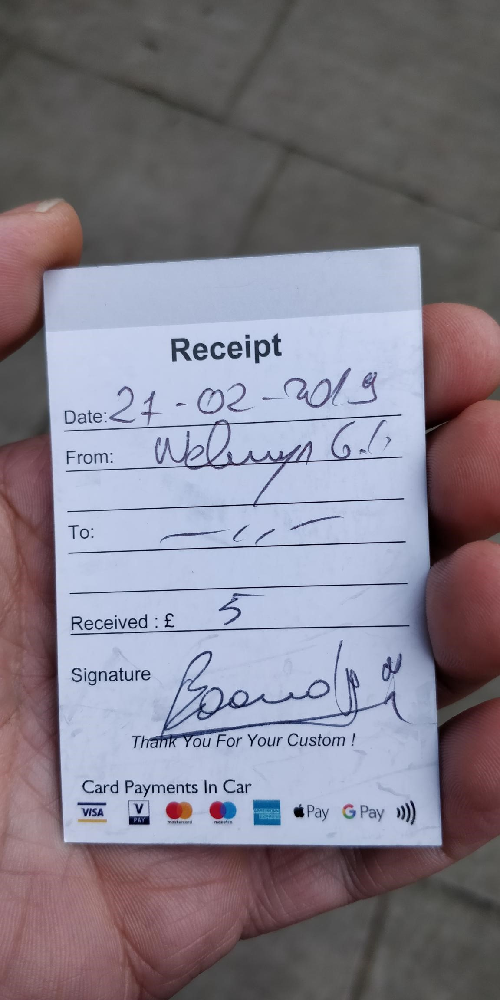
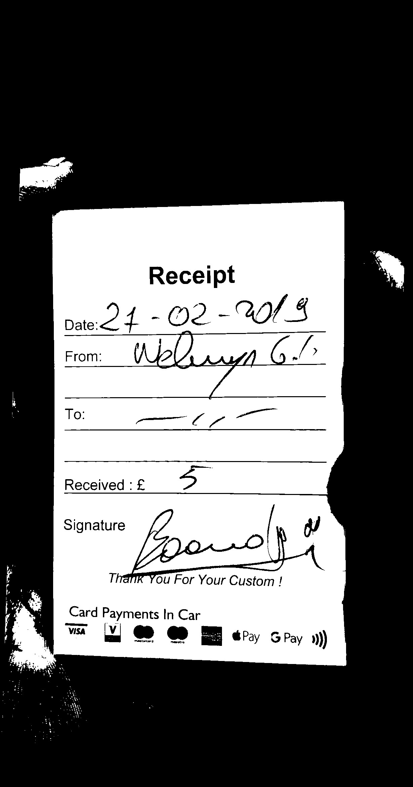
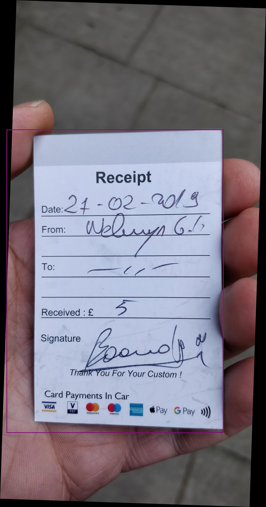
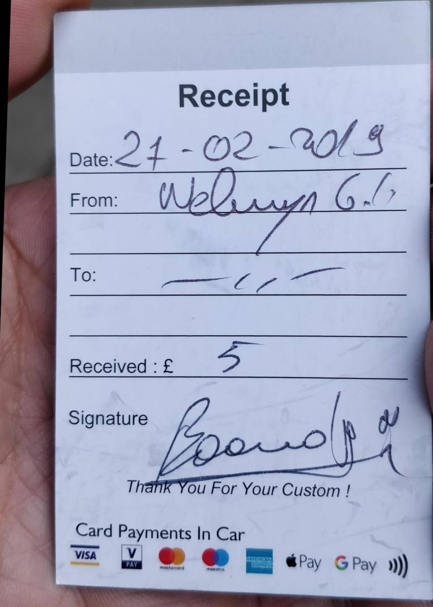

# Processing photos of invoices with Azure Function and Magick.NET

The goal of this project is to do some processing of photos of invoices and get them ready for submission to any internal systems. I've built it to use it myself and avoid manual steps.

This is the way it works:
a) you upload a series of photos to a specific container ("inbox") in an Azure Storage Blob;
b) the Azure Function kicks in, processes each image, and drops the output in another container ("outbox")

The processing steps it applies are:
- Reorient photo (sometimes there's metadata in the photo saying it was taken vertically or horizontally)
- Rotate image to make sure it's vertical (de-skew)
- Transform in black and white (using Otsu's method) and then find relevant regions
- Filter out smaller regions, in the assumption they are artifacts of the photo or irrelevant/contained in larger ones
- Find the bounding box to all the regions
- Crop the photo by bounding box
- Rescale to 1200px width (it's an arbitrary size, it tends to work for me)
- Write out as a 70%-quality JPEG

All the image processing magic is done with ImageMagick/Magick.NET.

## Deployment

I didn't have time yet to add ARM template/Powershell to do configurations, but I'll do time permitting. Basically you need one Azure Function and one Azure Storage Account blob. I'm uploading photos using an Android app (coded by my partner): https://github.com/MargaridaMC/AzurePhotoUploadAndroidApp that uploads photos and notifies when the processing is completed, but you can also use use Azure Storage Explorer. I've uploaded a file called readme.settings.json with the application settings required for the function to work.

## Limitations

I've tried out the code above with several invoices and it seems to work very well for most of them. It struggles when the photos are white-on-white (a white invoice over a white background), and in this case it won't work if the image has a skew.

## Samples

The table below shows some relevant images in the processing steps. All are scaled to the same horizontal width so that they fit. In the regions image, note the purple bounding box around the detected region.

<table>
  <tr><td>Original</td><td>After Otsu Threshold</td><td>Showing regions</td><td>Final</td></tr>
  <tr>
    <td ></td>
    <td></td>
    <td></td>
    <td></td></tr>
</table>

## TODO
- Call Azure Cognitive Services to do OCR + Identify if an image rotations is needed
- Script/automate the deployment
- Rename the output file according to the metadata/content of the photo
- Error handling (e.g., the file is not an image)
- Move some hardwired values to configuration (e.g., minimum size of the regions)
